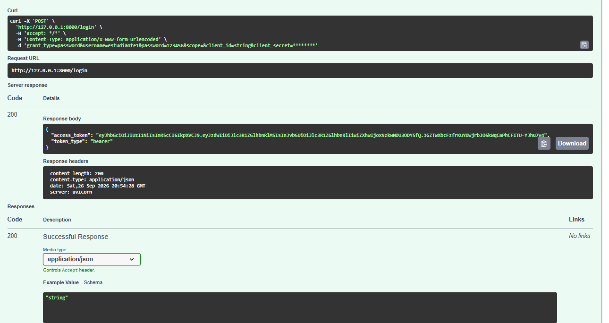
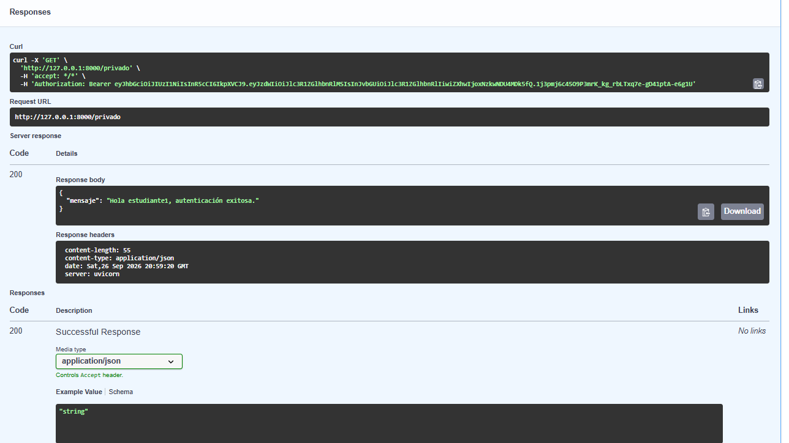
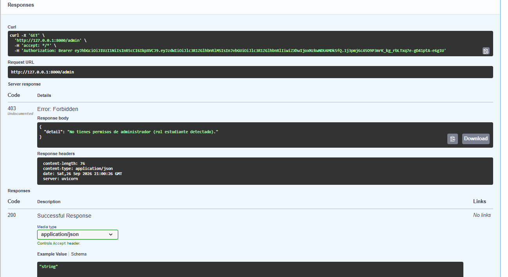

# Actividad de Entrega — FastAPI con JWT (Unidad IV • Semana 10)

## PARTE A — Conceptual
* **P1: ¿Qué significa JWT y cuáles son sus tres partes?**
  Significa JSON Web Token. Sus tres partes son: Header (Cabecera), Payload (Carga útil) y Signature (Firma).

* **P2: ¿Por qué el payload NO es seguro para guardar contraseñas?**
  Porque solo está codificado en Base64Url y no cifrado, lo que permite que cualquier persona pueda decodificarlo fácilmente en segundos.

* **P3: ¿Qué sucede si alguien modifica el payload sin conocer el SECRET_KEY?**
  La firma digital dejará de coincidir con el contenido modificado y el servidor rechazará el token por considerarlo inválido.

* **P4: Diferencia entre 401 Unauthorized y 403 Forbidden. ¿Cuándo usa cada uno FastAPI?**
  El código 401 se usa cuando el cliente no está autenticado o faltan credenciales, mientras que el 403 se usa cuando el usuario sí está autenticado pero no cuenta con los permisos o roles suficientes para acceder al recurso.

---

## PARTE B — Práctica (Capturas de Swagger)

1. **POST /login -> 200 con token**
   

2. **GET /privado -> 200 (autenticado)**
   

3. **GET /admin -> 403 (rol estudiante)**
   
   
